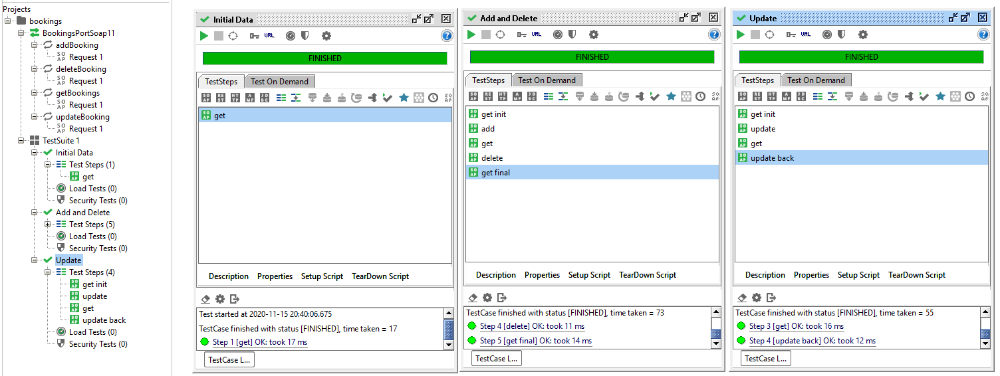

= HW3

Aplikace se spouští v souboru `WebServiceApplication.java` a konfiguruje v souboru `WebServiceConfig.java`. Samotná implementace je v souboru `WebServiceRepository.java`, který obsahuje jednotlivé metody pro práci s repozitářem a jeho úložiště v podobě jednoduchého statického listu. Aplikace vytváří endpointy v souboru `WebServiceEndpoint.java`, který využívá logiku repozitáře.

Nastavení a screenshot SoapUI je ve složce `results/`.

