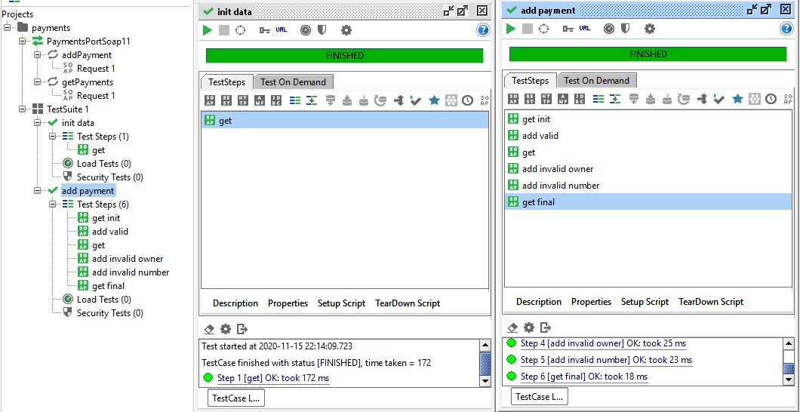
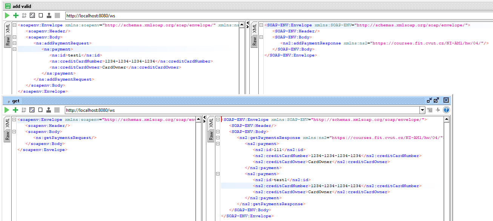
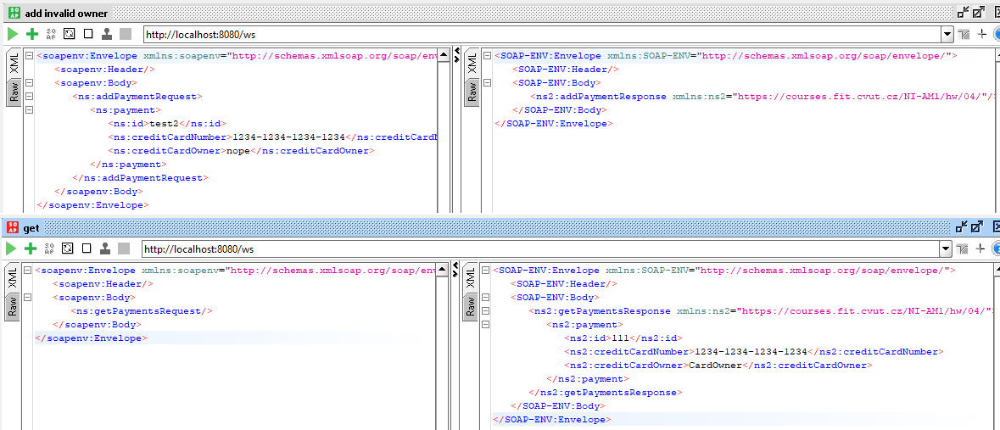

= HW4

Aplikace se spouští v souboru `WebServiceApplication.java` a konfiguruje v souboru `WebServiceConfig.java`. Samotná implementace je v souboru `WebServiceRepository.java`, který obsahuje jednotlivé metody pro práci s repozitářem a jeho úložiště v podobě jednoduchého statického listu, a souboru `WebServiceClient.java`, který interface pro komunikaci s validačním serverem. Aplikace vytváří endpointy v souboru `WebServiceEndpoint.java`, který využívá logiku repozitáře.

Nastavení SoapUI a screenshoty  jsou ve složce `results/`.

Ukázka validního vstupu:

Ukázka nevalidního vstupu:

