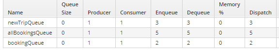

# Výsledky

*Order client* pošle 5x message v textové podobě v jednoduchém CSV-like formátu do `allBookingsQueue`, *Order processor* tuto frontu zpracuje a roztřídí podle identifikátoru zprávy (první hodnota). Tyto zprávy dle typu následně přepošle do `bookingQueue` a nebo `newTripQueue`.

Výsledný stav fronty pro `cz/cvut/fit/niam1/orderclient/OrderClientApplication.java:47`.

*Bookings processor* a **New trips processor* následně jen načtou data, přetvoří je v objekty a pro ukázku práce s nimi je vypíší.

## Log Order Client

Pouze posílá sekvenci náhodných dat pro 2x new trip, 2x booking a 1x new trip.

## Log Order Processor

[source,bash]
----
2020-12-20 20:21:52.837  INFO 44656 --- [enerContainer-1] c.c.f.n.o.OrderProcessorApplication      : Received confirmation message: trip;1;To somewhere;From somewhere;Some company;367
2020-12-20 20:21:52.841  INFO 44656 --- [enerContainer-1] c.c.f.n.o.OrderProcessorApplication      : sending to trip
2020-12-20 20:21:52.843  INFO 44656 --- [enerContainer-1] c.c.f.n.o.OrderProcessorApplication      : Received confirmation message: trip;2;To somewhere;From somewhere;Some company;255
2020-12-20 20:21:52.843  INFO 44656 --- [enerContainer-1] c.c.f.n.o.OrderProcessorApplication      : sending to trip
2020-12-20 20:21:52.844  INFO 44656 --- [enerContainer-1] c.c.f.n.o.OrderProcessorApplication      : Received confirmation message: booking;3;9;628;Some address
2020-12-20 20:21:52.846  INFO 44656 --- [enerContainer-1] c.c.f.n.o.OrderProcessorApplication      : sending to booking
2020-12-20 20:21:52.847  INFO 44656 --- [enerContainer-1] c.c.f.n.o.OrderProcessorApplication      : Received confirmation message: booking;4;12;487;Some address
2020-12-20 20:21:52.847  INFO 44656 --- [enerContainer-1] c.c.f.n.o.OrderProcessorApplication      : sending to booking
2020-12-20 20:21:52.848  INFO 44656 --- [enerContainer-1] c.c.f.n.o.OrderProcessorApplication      : Received confirmation message: trip;5;To somewhere;From somewhere;Some company;650
2020-12-20 20:21:52.849  INFO 44656 --- [enerContainer-1] c.c.f.n.o.OrderProcessorApplication      : sending to trip
----

## Log Bookings Processor

[source,bash]
----
2020-12-20 20:21:52.856  INFO 2820 --- [enerContainer-1] c.c.f.n.b.BookingProcessorApplication    : Processing 3;9;628;Some address
2020-12-20 20:21:52.857  INFO 2820 --- [enerContainer-1] c.c.f.n.b.BookingProcessorApplication    : Processing 4;12;487;Some address
----

## Log New Trip Processor

[source,bash]
----
2020-12-20 20:21:52.853  INFO 15988 --- [enerContainer-1] c.c.f.n.n.NewTripProcessorApplication    : Processing 1;To somewhere;From somewhere;Some company;367
2020-12-20 20:21:52.854  INFO 15988 --- [enerContainer-1] c.c.f.n.n.NewTripProcessorApplication    : Processing 2;To somewhere;From somewhere;Some company;255
2020-12-20 20:21:52.855  INFO 15988 --- [enerContainer-1] c.c.f.n.n.NewTripProcessorApplication    : Processing 5;To somewhere;From somewhere;Some company;650
----